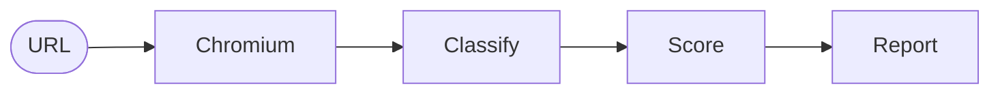

# gdpr-cookie-scanner

[](https://github.com/Slashgear/gdpr-cookie-scanner/actions/workflows/ci.yml)
[](https://www.npmjs.com/package/@slashgear/gdpr-cookie-scanner)
[](https://www.npmjs.com/package/@slashgear/gdpr-cookie-scanner)
[](LICENSE)
[](https://nodejs.org)
[](https://www.typescriptlang.org)
[](https://playwright.dev)
[](CODE_OF_CONDUCT.md)

A CLI tool that **automates a subset of GDPR cookie consent checks** on any website — consent modal detection, dark patterns, cookie behaviour before/after interaction, and network trackers. It produces a scored report (0–100) with a per-rule checklist and a cookie inventory.

> [!IMPORTANT]
> **This tool is not a substitute for a full GDPR compliance audit.**
> It automates the checks that _can_ be automated (observable browser behaviour), but GDPR compliance is broader: lawful basis, data retention policies, DPA agreements, privacy notices, subject rights, and more are **out of scope**.
> A grade of **A does not mean your site is GDPR-compliant** — it means it passes the automated checks covered by this tool.

### What problem does it solve?

Manually verifying that a consent banner behaves correctly — no cookies dropped before consent, reject as easy as accept, no pre-ticked boxes, no trackers firing before interaction — is tedious and hard to do consistently across environments or over time. `gdpr-scan` makes these checks **repeatable, scriptable, and CI-friendly**, giving DPOs, developers, and privacy engineers a fast feedback loop on the most common consent implementation mistakes.

## Installation

```bash
npm install -g @slashgear/gdpr-cookie-scanner
npx playwright install chromium
```

Or run without installing:

```bash
npx @slashgear/gdpr-cookie-scanner gdpr-scan scan https://example.com
# Playwright is still required the first time:
npx playwright install chromium
```

## Docker

No Node.js required — pull and run directly:

```bash
docker run --rm \
  -v $(pwd)/reports:/reports \
  ghcr.io/slashgear/gdpr-cookie-scanner \
  scan https://example.com -o /reports
```

The image is published to [GitHub Container Registry](https://ghcr.io/slashgear/gdpr-cookie-scanner)
on every release and supports `linux/amd64` and `linux/arm64`.

## Usage

```bash
gdpr-scan scan <url> [options]
```

### Options

| Option                   | Default          | Description                                                   |
| ------------------------ | ---------------- | ------------------------------------------------------------- |
| `-o, --output <dir>`     | `./gdpr-reports` | Output directory for the report                               |
| `-t, --timeout <ms>`     | `30000`          | Navigation timeout                                            |
| `-f, --format <formats>` | `md,pdf`         | Output formats: `md`, `html`, `json`, `pdf` (comma-separated) |
| `--no-screenshots`       | —                | Disable screenshot capture                                    |
| `-l, --locale <locale>`  | `fr-FR`          | Browser locale                                                |
| `-v, --verbose`          | —                | Show full stack trace on error                                |

### Examples

```bash
# Basic scan
gdpr-scan scan https://example.com

# With custom output directory
gdpr-scan scan https://example.com -o ./reports

# Scan in English, without screenshots
gdpr-scan scan https://example.com --locale en-US --no-screenshots

# Generate only an HTML report
gdpr-scan scan https://example.com -f html

# Generate all formats at once
gdpr-scan scan https://example.com -f md,html,json,pdf

# Show the built-in tracker database
gdpr-scan list-trackers
```

## How it works



A real Chromium browser loads the page, interacts with the consent modal (reject then accept in a fresh session), and captures cookies and network requests at each step. Results are classified, scored across 4 compliance dimensions, and rendered into one or more report files depending on `--format`.

## Generated reports

Each scan produces up to 4 file types in `<output-dir>/<hostname>/`:

| Format | Files                                                          | Description                                                                                                                                    |
| ------ | -------------------------------------------------------------- | ---------------------------------------------------------------------------------------------------------------------------------------------- |
| `md`   | `gdpr-report-*.md`, `gdpr-checklist-*.md`, `gdpr-cookies-*.md` | Main compliance report, per-rule checklist with legal references, and deduplicated cookie inventory                                            |
| `html` | `gdpr-report-*.html`                                           | Self-contained styled report — grade badge, score cards, dark-pattern issues, cookie and tracker tables. Opens in any browser, no dependencies |
| `json` | `gdpr-report-*.json`                                           | Full raw scan result for programmatic processing or CI integration                                                                             |
| `pdf`  | `gdpr-report-*.pdf`                                            | PDF built from the Markdown reports via Playwright                                                                                             |

All formats contain:

- **Global score** (0–100) and **grade** A/B/C/D/F
- Modal analysis: buttons, checkboxes, font size, screenshots
- Detected dark patterns (missing reject button, visual asymmetry, pre-ticked boxes, misleading wording…)
- Cookie table before interaction, after reject, after accept
- Network tracker requests by phase
- Targeted recommendations
- Legal references (RGPD, ePrivacy directive, CEPD guidelines, CNIL 2022)

## Scoring

The score is made up of 4 criteria (25 points each):

| Criterion            | What is evaluated                                                                              |
| -------------------- | ---------------------------------------------------------------------------------------------- |
| **Consent validity** | Pre-ticked boxes, ambiguous wording, missing information                                       |
| **Easy refusal**     | Missing or buried reject button, click asymmetry, visual asymmetry                             |
| **Transparency**     | Granular controls, mention of purposes / third parties / duration / right to withdraw          |
| **Cookie behavior**  | Non-essential cookies before consent, cookies persisting after reject, trackers before consent |

**Grade scale:** A ≥ 90 · B ≥ 75 · C ≥ 55 · D ≥ 35 · F < 35

The process exits with code `1` if the grade is F, `2` on scan error.

## Detected dark patterns

| Type                    | Severity         | Description                                           |
| ----------------------- | ---------------- | ----------------------------------------------------- |
| `no-reject-button`      | Critical         | No reject option in the modal                         |
| `buried-reject`         | Critical         | Reject button not present at the first layer          |
| `click-asymmetry`       | Critical         | Rejecting requires more clicks than accepting         |
| `pre-ticked`            | Critical         | Pre-ticked checkboxes (invalid under RGPD Recital 32) |
| `auto-consent`          | Critical         | Non-essential cookies/trackers before any consent     |
| `asymmetric-prominence` | Warning          | Accept button significantly larger than reject        |
| `nudging`               | Warning          | Accept button font larger than reject button font     |
| `misleading-wording`    | Warning/Critical | Ambiguous labels ("OK", "Continue"…)                  |
| `missing-info`          | Warning          | Mandatory information absent from the text            |

## Automatically recognised CMPs

Axeptio, Cookiebot, OneTrust, Didomi, Tarteaucitron, Usercentrics, and about twenty others via their specific CSS selectors. A heuristic fallback (fixed/sticky element with cookie-related text) covers custom banners.

## Development

```bash
pnpm dev          # Watch-mode compilation
pnpm typecheck    # Type-check without compiling
pnpm lint         # oxlint
pnpm format       # oxfmt
```

## Release

Releases are published automatically to [npm](https://www.npmjs.com/package/@slashgear/gdpr-cookie-scanner) via [Changesets](https://github.com/changesets/changesets). See [CONTRIBUTING.md](CONTRIBUTING.md) for the release process.

## Contributing

See [CONTRIBUTING.md](CONTRIBUTING.md). This project follows the [Contributor Covenant](CODE_OF_CONDUCT.md) code of conduct.
