# gdpr-cookie-scanner

[](https://github.com/Slashgear/gdpr-report/actions/workflows/ci.yml)
[](https://www.npmjs.com/package/@slashgear/gdpr-cookie-scanner)
[](https://www.npmjs.com/package/@slashgear/gdpr-cookie-scanner)
[](LICENSE)
[](https://nodejs.org)
[](https://www.typescriptlang.org)
[](https://playwright.dev)
[](CODE_OF_CONDUCT.md)

A CLI tool that **automates a subset of GDPR cookie consent checks** on any website — consent modal detection, dark patterns, cookie behaviour before/after interaction, and network trackers. It produces a scored report (0–100) with a per-rule checklist and a cookie inventory.

> [!IMPORTANT]
> **This tool is not a substitute for a full GDPR compliance audit.**
> It automates the checks that _can_ be automated (observable browser behaviour), but GDPR compliance is broader: lawful basis, data retention policies, DPA agreements, privacy notices, subject rights, and more are **out of scope**.
> A grade of **A does not mean your site is GDPR-compliant** — it means it passes the automated checks covered by this tool.

### What problem does it solve?

Manually verifying that a consent banner behaves correctly — no cookies dropped before consent, reject as easy as accept, no pre-ticked boxes, no trackers firing before interaction — is tedious and hard to do consistently across environments or over time. `gdpr-scan` makes these checks **repeatable, scriptable, and CI-friendly**, giving DPOs, developers, and privacy engineers a fast feedback loop on the most common consent implementation mistakes.

## Installation

```bash
npm install -g @slashgear/gdpr-cookie-scanner
npx playwright install chromium
```

Or run without installing:

```bash
npx @slashgear/gdpr-cookie-scanner gdpr-scan scan https://example.com
# Playwright is still required the first time:
npx playwright install chromium
```

## Usage

```bash
gdpr-scan scan <url> [options]
```

### Options

| Option                  | Default          | Description                     |
| ----------------------- | ---------------- | ------------------------------- |
| `-o, --output <dir>`    | `./gdpr-reports` | Output directory for the report |
| `-t, --timeout <ms>`    | `30000`          | Navigation timeout              |
| `--no-screenshots`      | —                | Disable screenshot capture      |
| `-l, --locale <locale>` | `fr-FR`          | Browser locale                  |
| `-v, --verbose`         | —                | Show full stack trace on error  |

### Examples

```bash
# Basic scan
gdpr-scan scan https://example.com

# With custom output directory
gdpr-scan scan https://example.com -o ./reports

# Scan in English, without screenshots
gdpr-scan scan https://example.com --locale en-US --no-screenshots

# Show the built-in tracker database
gdpr-scan list-trackers
```

## How it works

The scanner runs **4 phases** using a real Chromium browser (Playwright):

1. **Initial load** — The page is loaded without any interaction. All cookies and network requests are captured (`before-interaction`).
2. **Modal analysis** — The consent banner is detected (CSS selectors of known CMPs + DOM heuristics). Buttons are extracted with their visual properties (size, color, contrast ratio).
3. **Reject test** — The "Reject" button is clicked. Cookies and requests are captured (`after-reject`).
4. **Accept test** — A new browser session (clean state) loads the page and clicks "Accept". Cookies and requests are captured (`after-accept`).

## Architecture

```mermaid
flowchart TD
    CLI["⌨️ gdpr-scan CLI"]

    CLI --> B

    subgraph B["🌐 Chromium browser — 4 sequential phases"]
        direction TB
        P1["Phase 1 — Load page<br/>cookies + network requests captured<br/><i>before-interaction</i>"]
        P2["Phase 2 — Detect consent modal<br/>CSS selectors · DOM heuristics<br/>buttons, checkboxes, screenshots"]
        P3["Phase 3 — Click Reject<br/>state captured <i>after-reject</i>"]
        P4["Phase 4 — Fresh session · Click Accept<br/>state captured <i>after-accept</i>"]
        P1 --> P2 --> P3 --> P4
    end

    B --> C

    subgraph C["🔎 Classifiers"]
        direction LR
        CK["Cookie classifier<br/>name patterns → category<br/><i>analytics · ads · strictly-necessary…</i>"]
        NK["Network classifier<br/>tracker DB lookup<br/>pixel pattern matching"]
    end

    C --> A

    subgraph A["⚖️ Analyzers"]
        direction LR
        SC["Compliance scorer<br/>4 dimensions × 25 pts<br/>score 0–100 · grade A–F"]
        DP["Dark pattern detector<br/>pre-ticked · asymmetry<br/>missing reject · misleading wording"]
    end

    A --> R

    subgraph R["📄 Report generator"]
        direction LR
        MD1["gdpr-report-*.md<br/>main report"]
        MD2["gdpr-checklist-*.md<br/>per-rule checklist"]
        MD3["gdpr-cookies-*.md<br/>cookie inventory"]
        PDF["gdpr-report-*.pdf<br/>merged PDF with TOC"]
    end
```



The tool runs a **real Chromium browser** (via Playwright) through 4 isolated phases to capture the site's behaviour before any interaction, on modal detection, after rejection, and after acceptance. Raw data is then classified (cookies by name pattern, network requests against a tracker database), scored across 4 compliance dimensions, and rendered into 3 Markdown files plus a self-contained PDF.

## Generated report

The Markdown report contains:

- **Global score** (0–100) and **grade** A/B/C/D/F
- Executive summary
- Modal analysis: buttons, checkboxes, font size, screenshots
- Detected dark patterns (missing reject button, visual asymmetry, pre-ticked boxes, misleading wording…)
- Cookie table before interaction, after reject, after accept
- Network tracker requests by phase
- Targeted recommendations
- Legal references (RGPD, ePrivacy directive, CEPD guidelines, CNIL 2022)

The file is created at: `<output-dir>/gdpr-report-<domain>-<date>.md`

## Scoring

The score is made up of 4 criteria (25 points each):

| Criterion            | What is evaluated                                                                              |
| -------------------- | ---------------------------------------------------------------------------------------------- |
| **Consent validity** | Pre-ticked boxes, ambiguous wording, missing information                                       |
| **Easy refusal**     | Missing or buried reject button, click asymmetry, visual asymmetry                             |
| **Transparency**     | Granular controls, mention of purposes / third parties / duration / right to withdraw          |
| **Cookie behavior**  | Non-essential cookies before consent, cookies persisting after reject, trackers before consent |

**Grade scale:** A ≥ 90 · B ≥ 75 · C ≥ 55 · D ≥ 35 · F < 35

The process exits with code `1` if the grade is F, `2` on scan error.

## Detected dark patterns

| Type                    | Severity         | Description                                           |
| ----------------------- | ---------------- | ----------------------------------------------------- |
| `no-reject-button`      | Critical         | No reject option in the modal                         |
| `buried-reject`         | Critical         | Reject button not present at the first layer          |
| `click-asymmetry`       | Critical         | Rejecting requires more clicks than accepting         |
| `pre-ticked`            | Critical         | Pre-ticked checkboxes (invalid under RGPD Recital 32) |
| `auto-consent`          | Critical         | Non-essential cookies/trackers before any consent     |
| `asymmetric-prominence` | Warning          | Accept button significantly larger than reject        |
| `nudging`               | Warning          | Accept button font larger than reject button font     |
| `misleading-wording`    | Warning/Critical | Ambiguous labels ("OK", "Continue"…)                  |
| `missing-info`          | Warning          | Mandatory information absent from the text            |

## Automatically recognised CMPs

Axeptio, Cookiebot, OneTrust, Didomi, Tarteaucitron, Usercentrics, and about twenty others via their specific CSS selectors. A heuristic fallback (fixed/sticky element with cookie-related text) covers custom banners.

## Development

```bash
pnpm dev          # Watch-mode compilation
pnpm typecheck    # Type-check without compiling
pnpm lint         # oxlint
pnpm format       # oxfmt
```

## Release

Releases are published automatically to [npm](https://www.npmjs.com/package/@slashgear/gdpr-cookie-scanner) via [Changesets](https://github.com/changesets/changesets). See [CONTRIBUTING.md](CONTRIBUTING.md) for the release process.

## Contributing

See [CONTRIBUTING.md](CONTRIBUTING.md). This project follows the [Contributor Covenant](CODE_OF_CONDUCT.md) code of conduct.
