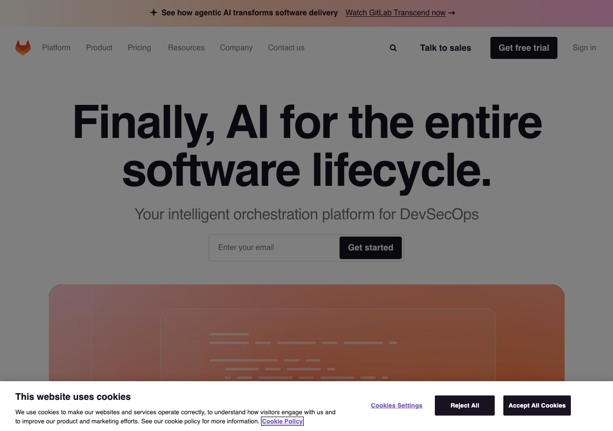

# GDPR Compliance Report — gitlab.com

> **Scan date:** 22/02/2026, 19:20:20
> **Scanned URL:** https://gitlab.com
> **Scan duration:** 15.9s
> **Tool:** gdpr-cookie-scanner v0.1.0

## Global Compliance Score

### 🔴 50/100 — Grade D

| Criterion        | Score      | Progress   | Status |
| ---------------- | ---------- | ---------- | ------ |
| Consent validity | 10/25      | ████░░░░░░ | ❌     |
| Easy refusal     | 25/25      | ██████████ | ✅     |
| Transparency     | 0/25       | ░░░░░░░░░░ | ❌     |
| Cookie behavior  | 15/25      | ██████░░░░ | ⚠️     |
| **TOTAL**        | **50/100** |            | **D**  |

## Executive Summary

✅ Consent modal detected (`#onetrust-banner-sdk`).
✅ No non-essential cookie set before interaction.
✅ Non-essential cookies are correctly removed after rejection.
❌ **11 tracker request(s)** fired before consent.

**1 critical issue(s)** and **5 warning(s)** identified.

## 1. Consent Modal

**CSS selector:** `#onetrust-banner-sdk`
**Granular controls:** ❌ No
**Layer count:** 1
**Privacy policy link:** ⚠️ Not found in the modal

### Detected buttons

| Button     | Text               | Visible | Font size | Contrast ratio |
| ---------- | ------------------ | ------- | --------- | -------------- |
| ❓ Unknown | Cookies Settings   | ✅      | 13.008px  | 5.26:1         |
| 🔴 Reject  | Reject All         | ✅      | 13.008px  | 18.24:1        |
| 🟢 Accept  | Accept All Cookies | ✅      | 13.008px  | 18.24:1        |

### Comparative analysis: Accept / Reject

✅ Accept / Reject button sizes are comparable.

### Screenshot

### Modal text excerpt

> This website uses cookiesWe use cookies to make our websites and services operate correctly, to understand how visitors engage with us and to improve our product and marketing efforts. See our cookie policy for more information.Cookie PolicyCookies Settings Reject All Accept All Cookies

## 2. Dark Patterns and Detected Issues

### ❌ Critical issues

**11 tracker request(s) fired before any consent**

> Google Tag Manager, Google AdSense, Tracking Pixel

### ⚠️ Warnings

**Missing required information: "purposes"**

> The consent text does not mention purposes

**Missing required information: "third-parties"**

> The consent text does not mention third-parties

**Missing required information: "withdrawal"**

> The consent text does not mention withdrawal

**No privacy policy link found in the consent modal**

> GDPR Art. 13 requires the privacy policy to be accessible from the consent interface

**No privacy policy link found on the page**

> A privacy policy must be accessible from every page (GDPR Art. 13)

## 3. Cookies Set Before Any Interaction

| Name             | Domain      | Category | Expiry    | Consent required |
| ---------------- | ----------- | -------- | --------- | ---------------- |
| `__cf_bm`        | .gitlab.com | unknown  | < 1 day   | ✅ No            |
| `_cfuvid`        | .gitlab.com | unknown  | Session   | ✅ No            |
| `OptanonConsent` | .gitlab.com | unknown  | 12 months | ✅ No            |

## 4. Cookies After Consent Rejection

✅ No non-essential cookie detected after rejection.

| Name                    | Domain      | Category | Expiry    | Consent required |
| ----------------------- | ----------- | -------- | --------- | ---------------- |
| `__cf_bm`               | .gitlab.com | unknown  | < 1 day   | ✅ No            |
| `_cfuvid`               | .gitlab.com | unknown  | Session   | ✅ No            |
| `OptanonAlertBoxClosed` | .gitlab.com | unknown  | 12 months | ✅ No            |
| `OptanonConsent`        | .gitlab.com | unknown  | 12 months | ✅ No            |

## 5. Cookies After Consent Acceptance

| Name                         | Domain            | Category    | Expiry    | Consent required |
| ---------------------------- | ----------------- | ----------- | --------- | ---------------- |
| `__cf_bm`                    | .gitlab.com       | unknown     | < 1 day   | ✅ No            |
| `_cfuvid`                    | .gitlab.com       | unknown     | Session   | ✅ No            |
| `OptanonAlertBoxClosed`      | .gitlab.com       | unknown     | 12 months | ✅ No            |
| `_gcl_au`                    | .gitlab.com       | unknown     | 3 months  | ✅ No            |
| `_ga`                        | .gitlab.com       | analytics   | 13 months | ⚠️ Yes           |
| `_ga_EVTFNG2S5Z`             | .gitlab.com       | analytics   | 13 months | ⚠️ Yes           |
| `_ga_ENFH3X7M5Y`             | .gitlab.com       | analytics   | 13 months | ⚠️ Yes           |
| `FPGSID`                     | .gitlab.com       | unknown     | < 1 day   | ✅ No            |
| `FPAU`                       | .gitlab.com       | unknown     | 3 months  | ⚠️ Yes           |
| `_sp_ses.6b85`               | .gitlab.com       | unknown     | < 1 day   | ✅ No            |
| `_sp_id.6b85`                | .gitlab.com       | unknown     | 13 months | ✅ No            |
| `_biz_uid`                   | .gitlab.com       | unknown     | 12 months | ✅ No            |
| `_biz_nA`                    | .gitlab.com       | unknown     | 12 months | ✅ No            |
| `mutiny.user.token`          | .gitlab.com       | unknown     | 13 months | ✅ No            |
| `mutiny.user.token`          | .about.gitlab.com | unknown     | 13 months | ✅ No            |
| `mutiny.user.session`        | .gitlab.com       | unknown     | < 1 day   | ✅ No            |
| `mutiny.user.session`        | .about.gitlab.com | unknown     | < 1 day   | ✅ No            |
| `_BUID`                      | .bizible.com      | unknown     | 12 months | ✅ No            |
| `_biz_pendingA`              | .gitlab.com       | unknown     | 12 months | ✅ No            |
| `mutiny.user.session_number` | .gitlab.com       | unknown     | < 1 day   | ✅ No            |
| `mutiny.user.session_number` | .about.gitlab.com | unknown     | < 1 day   | ✅ No            |
| `mutiny.optOut`              | .gitlab.com       | unknown     | 13 months | ✅ No            |
| `mutiny.optOut`              | .about.gitlab.com | unknown     | 13 months | ✅ No            |
| `mutiny.optIn`               | .gitlab.com       | unknown     | 13 months | ✅ No            |
| `mutiny.optIn`               | .about.gitlab.com | unknown     | 13 months | ✅ No            |
| `_fbp`                       | .gitlab.com       | advertising | 3 months  | ⚠️ Yes           |
| `_gtmeec`                    | .gitlab.com       | unknown     | 3 months  | ✅ No            |
| `IDE`                        | .doubleclick.net  | advertising | 13 months | ⚠️ Yes           |
| `_biz_flagsA`                | .gitlab.com       | unknown     | 12 months | ✅ No            |
| `_dcid`                      | .gitlab.com       | unknown     | 13 months | ✅ No            |
| `sa-userid`                  | .gitlab.com       | unknown     | 12 months | ✅ No            |
| `OptanonConsent`             | .gitlab.com       | unknown     | 12 months | ✅ No            |

## 6. Network Requests — Detected Trackers

### Before interaction (11 tracker(s))

| Tracker            | Category    | URL                                                            | Type     |
| ------------------ | ----------- | -------------------------------------------------------------- | -------- |
| Google Tag Manager | analytics   | `https://www.googletagmanager.com/gtm.js?id=GTM-NJXWQL`        | script   |
| Google Tag Manager | analytics   | `https://www.googletagmanager.com/gtag/js?id=AW-1097398738...` | script   |
| Google Tag Manager | analytics   | `https://www.googletagmanager.com/gtag/js?id=G-ENFH3X7M5Y&...` | script   |
| Google Tag Manager | analytics   | `https://www.googletagmanager.com/gtag/js?id=G-EVTFNG2S5Z&...` | script   |
| Google AdSense     | advertising | `https://pagead2.googlesyndication.com/pagead/conversion/1...` | fetch    |
| Tracking Pixel     | pixel       | `https://analytics.gitlab.com/g/collect?v=2&tid=G-ENFH3X7M...` | fetch    |
| Tracking Pixel     | pixel       | `https://analytics.gitlab.com/g/collect?v=2&tid=G-EVTFNG2S...` | fetch    |
| Google AdSense     | advertising | `https://pagead2.googlesyndication.com/ccm/collect?frm=0&e...` | fetch    |
| Google AdSense     | advertising | `https://pagead2.googlesyndication.com/ccm/collect?frm=0&e...` | fetch    |
| Google AdSense     | advertising | `https://pagead2.googlesyndication.com/ccm/collect?frm=0&d...` | fetch    |
| Google Tag Manager | analytics   | `https://www.googletagmanager.com/static/service_worker/62...` | document |

### After acceptance (25 tracker(s))

| Tracker            | Category    | URL                                                            | Type     |
| ------------------ | ----------- | -------------------------------------------------------------- | -------- |
| Google Tag Manager | analytics   | `https://www.googletagmanager.com/gtm.js?id=GTM-NJXWQL`        | script   |
| Google Tag Manager | analytics   | `https://www.googletagmanager.com/gtag/js?id=AW-1097398738...` | script   |
| Google Tag Manager | analytics   | `https://www.googletagmanager.com/gtag/js?id=G-ENFH3X7M5Y&...` | script   |
| Google Tag Manager | analytics   | `https://www.googletagmanager.com/gtag/js?id=G-EVTFNG2S5Z&...` | script   |
| Tracking Pixel     | pixel       | `https://analytics.gitlab.com/g/collect?v=2&tid=G-EVTFNG2S...` | fetch    |
| Google AdSense     | advertising | `https://pagead2.googlesyndication.com/pagead/conversion/1...` | fetch    |
| Tracking Pixel     | pixel       | `https://analytics.gitlab.com/g/collect?v=2&tid=G-ENFH3X7M...` | fetch    |
| Google Tag Manager | analytics   | `https://www.googletagmanager.com/static/service_worker/62...` | document |
| Google AdSense     | advertising | `https://pagead2.googlesyndication.com/ccm/collect?frm=0&e...` | fetch    |
| Google AdSense     | advertising | `https://pagead2.googlesyndication.com/ccm/collect?frm=0&e...` | fetch    |
| Google AdSense     | advertising | `https://pagead2.googlesyndication.com/ccm/collect?frm=0&d...` | fetch    |
| Tracking Pixel     | pixel       | `https://analytics.gitlab.com/g/collect?v=2&tid=G-EVTFNG2S...` | fetch    |
| Google DoubleClick | advertising | `https://googleads.g.doubleclick.net/pagead/viewthroughcon...` | script   |
| Google DoubleClick | advertising | `https://googleads.g.doubleclick.net/pagead/viewthroughcon...` | script   |
| Google Ad Services | advertising | `https://www.googleadservices.com/pagead/conversion/109739...` | fetch    |
| Tracking Pixel     | pixel       | `https://analytics.gitlab.com/g/collect?v=2&tid=G-ENFH3X7M...` | fetch    |
| Tracking Pixel     | pixel       | `https://analytics.gitlab.com/g/collect?v=2&tid=G-EVTFNG2S...` | fetch    |
| Tracking Pixel     | pixel       | `https://analytics.gitlab.com/g/collect?v=2&tid=G-ENFH3X7M...` | fetch    |
| Tracking Pixel     | pixel       | `https://www.google.com/ccm/collect?frm=0&en=consent_updat...` | fetch    |
| Tracking Pixel     | pixel       | `https://analytics.gitlab.com/data?v=2&event=page_view&dtd...` | image    |

_... and 5 additional request(s)._

## 7. Recommendations

1. **Do not set any non-essential cookie before consent.** Gate the initialisation of third-party scripts on acceptance.

1. **Complete the modal information**: purposes, identity of sub-processors, retention period, right to withdraw.

## Legal References

- **RGPD Art. 7** — Conditions for consent
- **RGPD Recital 32** — Consent must result from an unambiguous positive action
- **ePrivacy Directive 2002/58/EC** — Consent requirement for non-essential cookies
- **CEPD Guidelines 05/2020** — Consent under the RGPD
- **CEPD Guidelines 03/2022** — Dark patterns on platforms
- **CNIL Recommendation 2022** — Rejection must be as easy as acceptance (same number of clicks)
