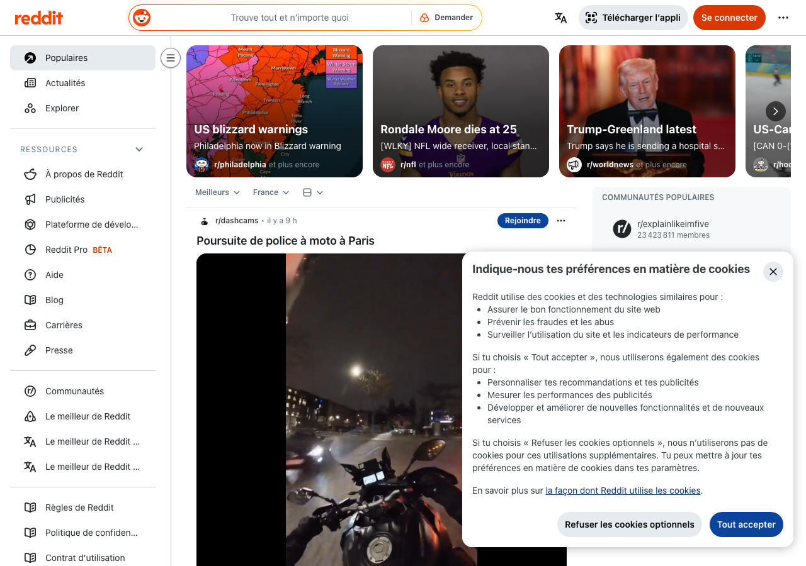

# GDPR Compliance Report — reddit.com

> **Scan date:** 22/02/2026, 19:17:05
> **Scanned URL:** https://reddit.com
> **Scan duration:** 38.6s
> **Tool:** gdpr-cookie-scanner v0.1.0

## Global Compliance Score

### 🔴 34/100 — Grade F

| Criterion        | Score      | Progress   | Status |
| ---------------- | ---------- | ---------- | ------ |
| Consent validity | 10/25      | ████░░░░░░ | ❌     |
| Easy refusal     | 10/25      | ████░░░░░░ | ❌     |
| Transparency     | 3/25       | █░░░░░░░░░ | ❌     |
| Cookie behavior  | 11/25      | ████░░░░░░ | ❌     |
| **TOTAL**        | **34/100** |            | **F**  |

## Executive Summary

✅ Consent modal detected (`[aria-label*='consent' i]`).
❌ **2 non-essential cookie(s)** set before any interaction (RGPD violation).
❌ **2 non-essential cookie(s)** persisting after rejection (RGPD violation).
❌ **3 tracker request(s)** fired before consent.

**4 critical issue(s)** and **4 warning(s)** identified.

## 1. Consent Modal

**CSS selector:** `[aria-label*='consent' i]`
**Granular controls:** ❌ No
**Layer count:** 1
**Privacy policy link:** ✅ [https://www.reddit.com/policies/privacy-policy](https://www.reddit.com/policies/privacy-policy)

### Detected buttons

| Button | Text | Visible | Font size | Contrast ratio |
| ------ | ---- | ------- | --------- | -------------- |

### Screenshot

### Modal text excerpt

>

## 2. Dark Patterns and Detected Issues

### ❌ Critical issues

**No reject/decline option found in the consent modal**

> RGPD requires refusal to be as easy as acceptance (CNIL 2022)

**No reject button on first layer**

> CNIL (2022) requires reject to require no more clicks than accept

**2 non-essential cookie(s) deposited before any interaction**

> loid (unknown), csv (unknown)

**3 tracker request(s) fired before any consent**

> Tracking Pixel (image)

### ⚠️ Warnings

**Missing required information: "purposes"**

> The consent text does not mention purposes

**Missing required information: "third-parties"**

> The consent text does not mention third-parties

**Missing required information: "duration"**

> The consent text does not mention duration

**Missing required information: "withdrawal"**

> The consent text does not mention withdrawal

## 3. Cookies Set Before Any Interaction

| Name                        | Domain                   | Category           | Expiry    | Consent required |
| --------------------------- | ------------------------ | ------------------ | --------- | ---------------- |
| `_GRECAPTCHA`               | www.google.com           | unknown            | 6 months  | ✅ No            |
| `loid`                      | .reddit.com              | unknown            | 13 months | ⚠️ Yes           |
| `csrf_token`                | .reddit.com              | strictly-necessary | Session   | ✅ No            |
| `token_v2`                  | .reddit.com              | unknown            | 1 days    | ✅ No            |
| `csv`                       | .reddit.com              | unknown            | 13 months | ⚠️ Yes           |
| `edgebucket`                | .reddit.com              | unknown            | 13 months | ✅ No            |
| `__cf_bm`                   | .emoji.redditmedia.com   | unknown            | < 1 day   | ✅ No            |
| `__cf_bm`                   | .w3-reporting.reddit.com | unknown            | < 1 day   | ✅ No            |
| `reddit_translation_status` | www.reddit.com           | unknown            | 12 months | ✅ No            |
| `session_tracker`           | .reddit.com              | unknown            | Session   | ✅ No            |

## 4. Cookies After Consent Rejection

✅ No non-essential cookie detected after rejection.

_No cookies detected._

## 5. Cookies After Consent Acceptance

_No cookies detected._

## 6. Network Requests — Detected Trackers

### Before interaction (3 tracker(s))

| Tracker                | Category | URL                                                            | Type  |
| ---------------------- | -------- | -------------------------------------------------------------- | ----- |
| Tracking Pixel (image) | pixel    | `https://alb.reddit.com/i.gif?za=5StXFRY3wvqDh-JoiRaI3yZCx...` | image |
| Tracking Pixel (image) | pixel    | `https://alb.reddit.com/i.gif?za=frMHcAyMwsXsELqF3U7dcfZjF...` | image |
| Tracking Pixel (image) | pixel    | `https://alb.reddit.com/i.gif?za=mfBCh2KQFCIvqVUd-h6GJ6Lfn...` | image |

## 7. Recommendations

1. **Add a "Reject all" button** at the first layer of the modal, requiring no more clicks than "Accept all" (CNIL 2022).

1. **Do not set any non-essential cookie before consent.** Gate the initialisation of third-party scripts on acceptance.

1. **Complete the modal information**: purposes, identity of sub-processors, retention period, right to withdraw.

1. **Remove or block non-essential cookies** after rejection, and verify consent handling server-side.

## Scan Errors and Warnings

- ⚠️ Navigation timeout or error: TimeoutError: page.goto: Timeout 30000ms exceeded.
  Call log:
   - navigating to "https://reddit.com/", waiting until "networkidle"

- ⚠️ No reject button found — could not test rejection flow
- ⚠️ No accept button found — could not test acceptance flow

## Legal References

- **RGPD Art. 7** — Conditions for consent
- **RGPD Recital 32** — Consent must result from an unambiguous positive action
- **ePrivacy Directive 2002/58/EC** — Consent requirement for non-essential cookies
- **CEPD Guidelines 05/2020** — Consent under the RGPD
- **CEPD Guidelines 03/2022** — Dark patterns on platforms
- **CNIL Recommendation 2022** — Rejection must be as easy as acceptance (same number of clicks)
