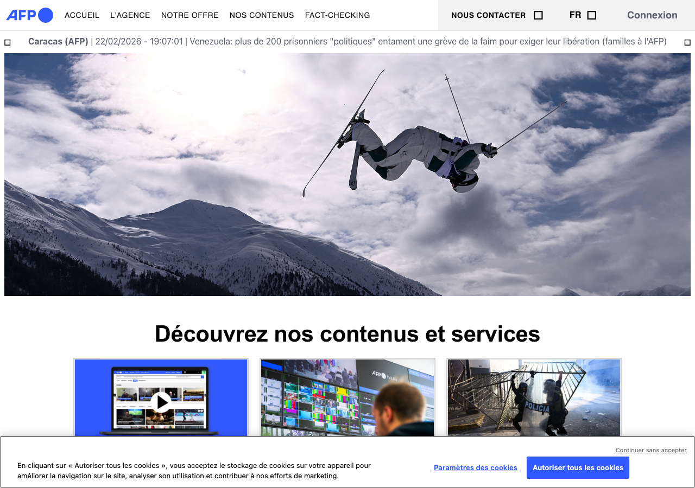

# GDPR Compliance Report — www.afp.com

> **Scan date:** 22/02/2026, 19:36:58
> **Scanned URL:** https://www.afp.com/
> **Scan duration:** 14.0s
> **Tool:** gdpr-cookie-scanner v0.1.0

## Global Compliance Score

### 🔴 47/100 — Grade D

| Criterion        | Score      | Progress   | Status |
| ---------------- | ---------- | ---------- | ------ |
| Consent validity | 20/25      | ████████░░ | ✅     |
| Easy refusal     | 10/25      | ████░░░░░░ | ❌     |
| Transparency     | 14/25      | ██████░░░░ | ⚠️     |
| Cookie behavior  | 3/25       | █░░░░░░░░░ | ❌     |
| **TOTAL**        | **47/100** |            | **D**  |

## Executive Summary

✅ Consent modal detected (`#onetrust-banner-sdk`).
❌ **3 non-essential cookie(s)** set before any interaction (RGPD violation).
❌ **3 non-essential cookie(s)** persisting after rejection (RGPD violation).
❌ **13 tracker request(s)** fired before consent.

**3 critical issue(s)** and **3 warning(s)** identified.

## 1. Consent Modal

**CSS selector:** `#onetrust-banner-sdk`
**Granular controls:** ✅ Yes
**Layer count:** 2
**Privacy policy link:** ⚠️ Not found in the modal

### Detected buttons

| Button         | Text                       | Visible | Font size | Contrast ratio |
| -------------- | -------------------------- | ------- | --------- | -------------- |
| ⚙️ Preferences | Paramètres des cookies     | ✅      | 13.008px  | 5.2:1          |
| ❓ Unknown     | Autoriser tous les cookies | ✅      | 13.008px  | 5.2:1          |
| 🟢 Accept      | Continuer sans accepter    | ✅      | 11.04px   | 3.83:1         |

### Screenshot

### Modal text excerpt

> En cliquant sur « Autoriser tous les cookies », vous acceptez le stockage de cookies sur votre appareil pour améliorer la navigation sur le site, analyser son utilisation et contribuer à nos efforts de marketing. Paramètres des cookies Autoriser tous les cookiesContinuer sans accepter

## 2. Dark Patterns and Detected Issues

### ❌ Critical issues

**No reject button on first layer**

> CNIL (2022) requires reject to require no more clicks than accept

**3 non-essential cookie(s) deposited before any interaction**

> YSC (social), bcookie (advertising), li_gc (advertising)

**13 tracker request(s) fired before any consent**

> Google Tag Manager, LinkedIn Insight Tag, Microsoft Clarity, Tracking Pixel

### ⚠️ Warnings

**Missing required information: "third-parties"**

> The consent text does not mention third-parties

**Missing required information: "withdrawal"**

> The consent text does not mention withdrawal

**No privacy policy link found in the consent modal**

> GDPR Art. 13 requires the privacy policy to be accessible from the consent interface

## 3. Cookies Set Before Any Interaction

| Name                                                | Domain        | Category    | Expiry    | Consent required |
| --------------------------------------------------- | ------------- | ----------- | --------- | ---------------- |
| `__Secure-YNID`                                     | .youtube.com  | unknown     | 6 months  | ✅ No            |
| `YSC`                                               | .youtube.com  | social      | Session   | ⚠️ Yes           |
| `__Secure-ROLLOUT_TOKEN`                            | .youtube.com  | unknown     | 6 months  | ✅ No            |
| `VISITOR_INFO1_LIVE`                                | .youtube.com  | unknown     | 6 months  | ✅ No            |
| `VISITOR_PRIVACY_METADATA`                          | .youtube.com  | unknown     | 6 months  | ✅ No            |
| `_mkto_trk`                                         | .afp.com      | unknown     | 13 months | ✅ No            |
| `_gcl_au`                                           | .afp.com      | unknown     | 3 months  | ✅ No            |
| `gtmreferers`                                       | www.afp.com   | unknown     | 3 months  | ✅ No            |
| `_pcid`                                             | .afp.com      | unknown     | 13 months | ✅ No            |
| `_pctx`                                             | .afp.com      | unknown     | 13 months | ✅ No            |
| `_pprv`                                             | .afp.com      | unknown     | 13 months | ✅ No            |
| `OptanonConsent`                                    | .www.afp.com  | unknown     | 12 months | ✅ No            |
| `__cf_bm`                                           | .page.afp.com | unknown     | < 1 day   | ✅ No            |
| `bcookie`                                           | .linkedin.com | advertising | 12 months | ⚠️ Yes           |
| `li_gc`                                             | .linkedin.com | advertising | 6 months  | ⚠️ Yes           |
| `lidc`                                              | .linkedin.com | unknown     | 1 days    | ✅ No            |
| `BIGipServer~VS65000-N117~lon08web-nginx-app_https` | page.afp.com  | unknown     | Session   | ✅ No            |

## 4. Cookies After Consent Rejection

✅ No non-essential cookie detected after rejection.

_No cookies detected._

## 5. Cookies After Consent Acceptance

| Name                                                | Domain        | Category    | Expiry    | Consent required |
| --------------------------------------------------- | ------------- | ----------- | --------- | ---------------- |
| `AKA_A2`                                            | .afp.com      | unknown     | < 1 day   | ✅ No            |
| `_mkto_trk`                                         | .afp.com      | unknown     | 13 months | ✅ No            |
| `__Secure-YNID`                                     | .youtube.com  | unknown     | 6 months  | ✅ No            |
| `YSC`                                               | .youtube.com  | social      | Session   | ⚠️ Yes           |
| `VISITOR_INFO1_LIVE`                                | .youtube.com  | unknown     | 6 months  | ✅ No            |
| `VISITOR_PRIVACY_METADATA`                          | .youtube.com  | unknown     | 6 months  | ✅ No            |
| `__Secure-ROLLOUT_TOKEN`                            | .youtube.com  | unknown     | 6 months  | ✅ No            |
| `_gcl_au`                                           | .afp.com      | unknown     | 3 months  | ✅ No            |
| `gtmreferers`                                       | www.afp.com   | unknown     | 3 months  | ✅ No            |
| `__cf_bm`                                           | .page.afp.com | unknown     | < 1 day   | ✅ No            |
| `_pcid`                                             | .afp.com      | unknown     | 13 months | ✅ No            |
| `_pctx`                                             | .afp.com      | unknown     | 13 months | ✅ No            |
| `bcookie`                                           | .linkedin.com | advertising | 12 months | ⚠️ Yes           |
| `li_gc`                                             | .linkedin.com | advertising | 6 months  | ⚠️ Yes           |
| `lidc`                                              | .linkedin.com | unknown     | 1 days    | ✅ No            |
| `BIGipServer~VS65000-N117~lon08web-nginx-app_https` | page.afp.com  | unknown     | Session   | ✅ No            |
| `OptanonAlertBoxClosed`                             | .www.afp.com  | unknown     | 12 months | ✅ No            |
| `OptanonConsent`                                    | .www.afp.com  | unknown     | 12 months | ✅ No            |
| `_pprv`                                             | .afp.com      | unknown     | 13 months | ✅ No            |

## 6. Network Requests — Detected Trackers

### Before interaction (13 tracker(s))

| Tracker              | Category    | URL                                                            | Type     |
| -------------------- | ----------- | -------------------------------------------------------------- | -------- |
| Google Tag Manager   | analytics   | `https://www.googletagmanager.com/gtm.js?id=GTM-T4C5DKK`       | script   |
| Google Tag Manager   | analytics   | `https://www.googletagmanager.com/gtag/js?id=AW-1090164081...` | script   |
| LinkedIn Insight Tag | advertising | `https://snap.licdn.com/li.lms-analytics/insight.min.js`       | script   |
| Microsoft Clarity    | analytics   | `https://www.clarity.ms/tag/t3we3mu2lf?ref=gtm`                | script   |
| Tracking Pixel       | pixel       | `https://www.google.com/ccm/collect?frm=0&en=page_view&dl=...` | fetch    |
| Google Tag Manager   | analytics   | `https://www.googletagmanager.com/static/service_worker/62...` | document |
| Tracking Pixel       | pixel       | `https://www.google.com/ccm/collect?frm=0&en=page_view&dl=...` | fetch    |
| Tracking Pixel       | pixel       | `https://kxgqdwd.pa-cd.com/event?s=628508&idclient=mly3a95...` | ping     |
| Tracking Pixel       | pixel       | `https://px.ads.linkedin.com/collect?v=2&fmt=js&pid=347975...` | image    |
| Microsoft Clarity    | analytics   | `https://scripts.clarity.ms/0.8.54/clarity.js`                 | script   |
| Microsoft Clarity    | analytics   | `https://y.clarity.ms/collect`                                 | xhr      |
| Tracking Pixel       | pixel       | `https://px4.ads.linkedin.com/collect?v=2&fmt=js&pid=34797...` | image    |
| Microsoft Clarity    | analytics   | `https://y.clarity.ms/collect`                                 | xhr      |

### After acceptance (26 tracker(s))

| Tracker              | Category    | URL                                                            | Type     |
| -------------------- | ----------- | -------------------------------------------------------------- | -------- |
| Google Tag Manager   | analytics   | `https://www.googletagmanager.com/gtm.js?id=GTM-T4C5DKK`       | script   |
| Google Tag Manager   | analytics   | `https://www.googletagmanager.com/gtag/js?id=AW-1090164081...` | script   |
| LinkedIn Insight Tag | advertising | `https://snap.licdn.com/li.lms-analytics/insight.min.js`       | script   |
| Microsoft Clarity    | analytics   | `https://www.clarity.ms/tag/t3we3mu2lf?ref=gtm`                | script   |
| Google Tag Manager   | analytics   | `https://www.googletagmanager.com/a?id=GTM-T4C5DKK&v=3&t=t...` | image    |
| Google Tag Manager   | analytics   | `https://www.googletagmanager.com/a?id=GTM-T4C5DKK&v=3&t=t...` | image    |
| Tracking Pixel       | pixel       | `https://www.google.com/ccm/collect?frm=0&en=page_view&dl=...` | fetch    |
| Google Tag Manager   | analytics   | `https://www.googletagmanager.com/a?id=GTM-T4C5DKK&v=3&t=t...` | image    |
| Google Tag Manager   | analytics   | `https://www.googletagmanager.com/a?id=GTM-T4C5DKK&v=3&t=t...` | image    |
| Google Tag Manager   | analytics   | `https://www.googletagmanager.com/a?id=GTM-T4C5DKK&v=3&t=t...` | image    |
| Google Tag Manager   | analytics   | `https://www.googletagmanager.com/static/service_worker/62...` | document |
| Tracking Pixel       | pixel       | `https://www.google.com/ccm/collect?frm=0&en=page_view&dl=...` | fetch    |
| Google Tag Manager   | analytics   | `https://www.googletagmanager.com/a?ctid=GTM-T4C5DKK&t=s&s...` | image    |
| Tracking Pixel       | pixel       | `https://kxgqdwd.pa-cd.com/event?s=628508&idclient=mly3ad9...` | ping     |
| Tracking Pixel       | pixel       | `https://px.ads.linkedin.com/collect?v=2&fmt=js&pid=347975...` | image    |
| Microsoft Clarity    | analytics   | `https://scripts.clarity.ms/0.8.54/clarity.js`                 | script   |
| Microsoft Clarity    | analytics   | `https://y.clarity.ms/collect`                                 | xhr      |
| Tracking Pixel       | pixel       | `https://px4.ads.linkedin.com/collect?v=2&fmt=js&pid=34797...` | image    |
| Google Tag Manager   | analytics   | `https://www.googletagmanager.com/a?id=GTM-T4C5DKK&v=3&t=t...` | image    |
| Microsoft Clarity    | analytics   | `https://y.clarity.ms/collect`                                 | xhr      |

_... and 6 additional request(s)._

## 7. Recommendations

1. **Add a "Reject all" button** at the first layer of the modal, requiring no more clicks than "Accept all" (CNIL 2022).

1. **Do not set any non-essential cookie before consent.** Gate the initialisation of third-party scripts on acceptance.

1. **Complete the modal information**: purposes, identity of sub-processors, retention period, right to withdraw.

1. **Remove or block non-essential cookies** after rejection, and verify consent handling server-side.

## Scan Errors and Warnings

- ⚠️ No reject button found — could not test rejection flow

## Legal References

- **RGPD Art. 7** — Conditions for consent
- **RGPD Recital 32** — Consent must result from an unambiguous positive action
- **ePrivacy Directive 2002/58/EC** — Consent requirement for non-essential cookies
- **CEPD Guidelines 05/2020** — Consent under the RGPD
- **CEPD Guidelines 03/2022** — Dark patterns on platforms
- **CNIL Recommendation 2022** — Rejection must be as easy as acceptance (same number of clicks)
